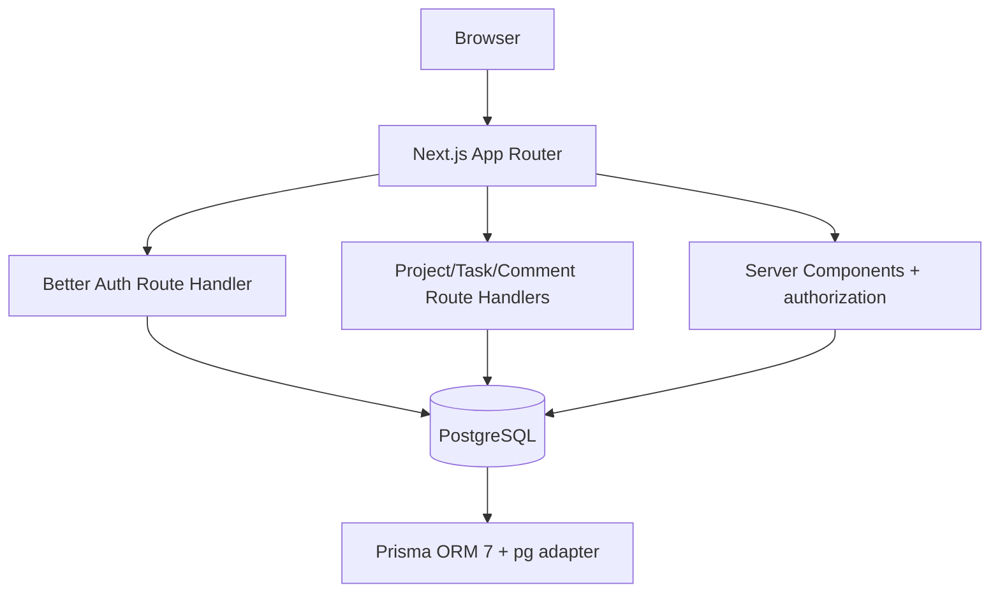

# Container / Module View

```mermaid
flowchart TB
  Browser --> Web[Next.js App Router]
  Web --> AuthRoute[Better Auth Route Handler]
  Web --> ProjectAPI[Project/Task/Comment Route Handlers]
  Web --> ServerReads[Server Components + authorization]
  AuthRoute --> PG[(PostgreSQL)]
  ProjectAPI --> PG
  ServerReads --> PG
  PG --> Prisma[Prisma ORM 7 + pg adapter]
```

The "backend" is intentionally part of the Next.js deployment. There is no separate application server.
