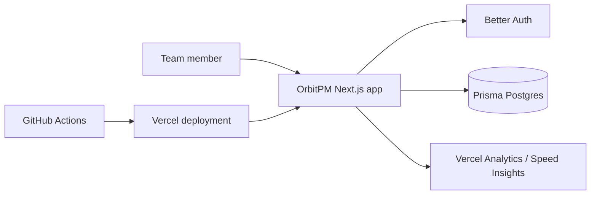

# System Context

OrbitPM is a single web application used by authenticated teams to plan and execute projects.

```mermaid
flowchart LR
  User[Team member] --> App[OrbitPM Next.js app]
  App --> Auth[Better Auth]
  App --> DB[(Prisma Postgres)]
  App --> Telemetry[Vercel Analytics / Speed Insights]
  CI[GitHub Actions] --> AppDeploy[Vercel deployment]
  AppDeploy --> App
```
