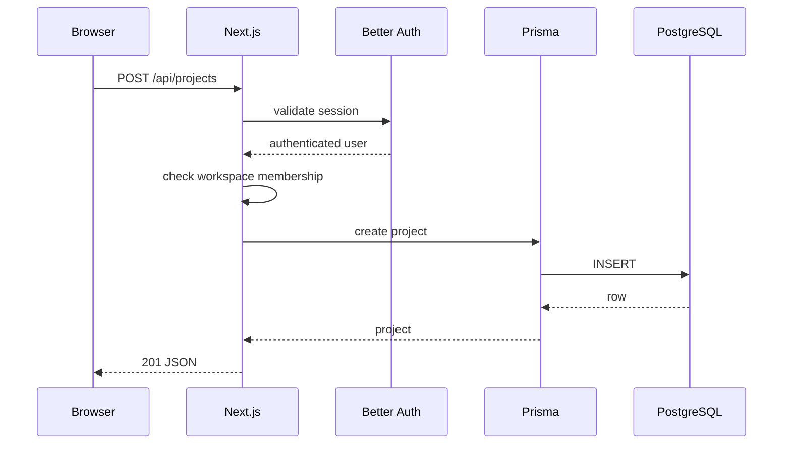

# Data Flow

Authorization is evaluated before every project/task/comment mutation. IDs are scoped through workspace ownership queries so a client cannot select another workspace by changing a route parameter.
