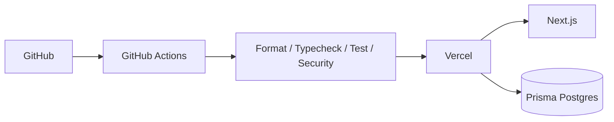

# Deployment Architecture

Production target:

- Vercel hosts the Next.js application.
- Prisma Postgres is provisioned through the Vercel Marketplace.
- GitHub Actions provides merge/security gates.
- Vercel preview deployments validate pull-request builds.

Migrations are released as an explicit deployment step instead of being hidden inside every application build.
